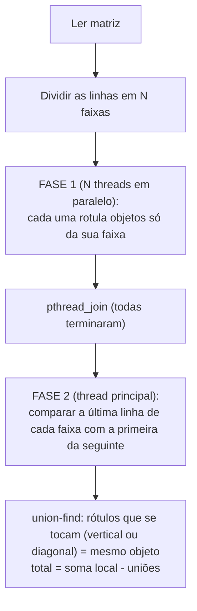

# Contagem paralela de objetos em uma matriz binária

Trabalho prático de **Sistemas Operacionais (2026/II)**, PUCRS, Escola Politécnica, com o Prof. Filipo Novo Mór.

**Autoria:** Luca Wolffenbuttel Bohnenberger e Louise Zanol Northfleet

O programa conta quantos **objetos** existem em uma matriz binária (`0` = fundo, `1` = objeto). Um objeto é um grupo de células `1` ligadas por lado ou por canto (**conectividade 8**). Há duas versões em **ANSI C (C89)**:

| Versão | Arquivo | Como funciona |
|---|---|---|
| Sequencial | [`src/sequencial.c`](src/sequencial.c) | Percorre a matriz. A cada `1` não visitado, conta um objeto e marca o objeto inteiro com *flood fill* iterativo. |
| Paralela | [`src/paralelo.c`](src/paralelo.c) | **Pthreads**. Divide a matriz em faixas de linhas, uma por thread, e cada thread conta e rotula os objetos da sua faixa. Depois dos `join`, une os pedaços de objetos que cruzam as fronteiras entre faixas com *union-find*. |

O relatório completo (arquitetura, testes, desempenho e análise) está em **[`RELATORIO_TECNICO.md`](RELATORIO_TECNICO.md)**.

---

## Sumário

1. [Requisitos](#1-requisitos)
2. [Início rápido](#2-início-rápido)
3. [Onde está cada coisa](#3-onde-está-cada-coisa)
4. [Compilação](#4-compilação)
5. [Como executar](#5-como-executar)
6. [Formato do arquivo de matriz (.txt)](#6-formato-do-arquivo-de-matriz-txt)
7. [Alvos do Makefile](#7-alvos-do-makefile)
8. [Testes](#8-testes)
9. [Desempenho (benchmark e gráficos)](#9-desempenho-benchmark-e-gráficos)
10. [Arquitetura da solução paralela](#10-arquitetura-da-solução-paralela)
11. [Resultados](#11-resultados)
12. [Ferramentas e referências externas](#12-ferramentas-e-referências-externas)

---

## 1. Requisitos

- Linux ou macOS
- Compilador C (`cc`, `gcc` ou `clang`) e `make`
- Pthreads (já vem com o sistema)
- Opcional, só para os scripts auxiliares:
  - `python3`, para gerar a matriz grande;
  - `matplotlib`, para os gráficos;
  - `sh`, para o benchmark.

## 2. Início rápido

```bash
make            # compila as duas versões em build/
make testes     # roda todos os testes (sequencial + paralelo com 1, 2, 3, 4 e 8 threads)
make grande     # roda a matriz 2000x2000 com 8 objetos nas duas versões
```

## 3. Onde está cada coisa

```text
.
├── README.md                    este arquivo
├── RELATORIO_TECNICO.md         relatório técnico completo
├── Makefile                     compilação, testes, benchmark e gráficos
├── src/
│   ├── sequencial.c             versão sequencial (referência)
│   └── paralelo.c               versão paralela (Pthreads)
├── tests/
│   ├── obrigatorios/            as 5 matrizes do enunciado (ex1.txt ... ex5.txt)
│   └── adicionais/              casos de borda + matriz grande
│       ├── vazia.txt                só zeros (0 objetos)
│       ├── cheia.txt                só uns (1 objeto em todas as faixas)
│       ├── xadrez.txt               ligações só pela diagonal (1 objeto)
│       ├── diagonais_cruzando.txt   diagonais atravessando fronteiras (2)
│       ├── em_u.txt                 "U": pernas que só se unem embaixo (1)
│       ├── linha_unica.txt          1 linha, valores sem espaço (4)
│       └── matriz_grande.txt        2000 x 2000 com 8 objetos (desempenho)
├── scripts/
│   ├── gera_matriz_grande.py    gera matriz_grande.txt e confere os 8 objetos
│   ├── benchmark.sh             mede os tempos e grava results/medicoes.csv
│   └── graficos.py              gera results/resumo.md e os gráficos .png
├── results/
│   ├── testes.log               saída de "make testes"
│   ├── medicoes.csv             dados brutos do benchmark
│   ├── resumo.md                tabela com mediana, aceleração e eficiência
│   └── grafico-*.png            tempo, aceleração e eficiência
└── build/                       executáveis (criado pelo make, não versionado)
```

### Dentro do código

Os dois arquivos `.c` têm a mesma organização, com seções marcadas por comentários:

| Seção / função | `sequencial.c` | `paralelo.c` | O que faz |
|---|---|---|---|
| `aloca_matriz`, `libera_matriz` | ✓ | ✓ | Alocação dinâmica dos vetores (matriz, visitados/rótulos, pilha). |
| `inunda` | ✓ | ✓ | *Flood fill* **iterativo**, com pilha no heap, nos 8 vizinhos. Na paralela, não sai da faixa da thread. |
| `conta_objetos` | ✓ | ✓ | Contagem. Na paralela: divide em faixas, cria as threads (fase 1), faz os joins e consolida as fronteiras (fase 2). |
| `trabalhador` | — | ✓ | Função de cada thread: zera e rotula a própria faixa. |
| `acha`, `uniao` | — | ✓ | *Union-find* usado na consolidação. |
| `agora_ms` | ✓ | ✓ | Relógio `clock_gettime(CLOCK_MONOTONIC)`. |
| `carrega` | ✓ | ✓ | Copia um caso embutido para a matriz de trabalho. |
| `le_arquivo` | ✓ | ✓ | Lê uma matriz de um arquivo `.txt`. |
| `ex1` ... `ex5`, `casos[]` | ✓ | ✓ | As 5 matrizes obrigatórias embutidas no código, com o resultado esperado. |
| `executa_caso`, `executa_arquivo`, `main` | ✓ | ✓ | Interface de linha de comando. |

## 4. Compilação

Com `make`, os executáveis são criados em `build/`:

```bash
make
```

Sem `make`, os comandos equivalentes são:

```bash
mkdir -p build
cc -std=c89 -Wall -Wextra -pedantic -O2 src/sequencial.c -o build/sequencial
cc -std=c89 -Wall -Wextra -pedantic -O2 -pthread src/paralelo.c -o build/paralelo
```

As duas versões compilam **sem nenhum aviso** com essas flags. Para apagar os executáveis, use `make clean`.

## 5. Como executar

### 5.1 Versão sequencial

```text
./build/sequencial <caso>            caso = 1..5, "todos" ou "lista"
./build/sequencial -f <arquivo.txt>  lê a matriz de um arquivo
```

Exemplos:

```bash
./build/sequencial lista                               # lista os 5 casos embutidos
./build/sequencial 3                                   # roda só o exemplo 3
./build/sequencial todos                               # roda os 5 exemplos
./build/sequencial -f tests/obrigatorios/ex2.txt       # matriz de um arquivo
./build/sequencial -f tests/adicionais/matriz_grande.txt
```

### 5.2 Versão paralela

```text
./build/paralelo <caso> [threads]            caso = 1..5, "todos" ou "lista"
./build/paralelo -f <arquivo.txt> [threads]  lê a matriz de um arquivo
```

`threads` vai de 1 a 64, e o padrão é **2**. Se houver mais threads que linhas, o programa usa uma thread por linha.

Exemplos:

```bash
./build/paralelo todos              # 5 exemplos com 2 threads
./build/paralelo todos 4            # 5 exemplos com 4 threads
./build/paralelo 5 3                # exemplo 5 com 3 threads
./build/paralelo -f tests/adicionais/matriz_grande.txt 8
```

### 5.3 O que é impresso

```text
$ ./build/sequencial todos
Ex1 - Identificacao basica (5x5): obtido=3 esperado=3 [OK]
...
$ ./build/paralelo -f tests/adicionais/matriz_grande.txt 8
tests/adicionais/matriz_grande.txt (2000x2000) [8 threads]: obtido=8 esperado=8 [OK] tempo_ms=31.512
```

- `obtido`: quantidade de objetos contada.
- `esperado` e `[OK]`/`[FALHOU]`: só aparecem quando o valor esperado é conhecido (casos embutidos ou cabeçalho do arquivo).
- `tempo_ms`: tempo só da contagem, sem a leitura do arquivo. Aparece no modo `-f` e varia a cada execução.
- **Código de saída:** `0` se tudo passou, `1` se algum resultado diferiu do esperado ou houve erro (arquivo inexistente, formato inválido, argumentos errados).

## 6. Formato do arquivo de matriz (.txt)

```text
# Linhas que começam com '#' antes do cabeçalho são comentários.
# Cabeçalho: <linhas> <colunas> [objetos_esperados]
5 5 3
1 1 0 0 0
1 1 0 0 0
0 0 0 1 0
0 0 0 1 0
1 0 0 0 0
```

- O **terceiro número do cabeçalho é opcional**. Se existir, o programa compara o resultado e imprime `[OK]` ou `[FALHOU]`.
- Os valores podem estar separados por espaço, tab, vírgula ou quebra de linha, **ou sem separador nenhum**. Por exemplo, `11000` é uma linha válida. A matriz grande usa esse formato compacto.
- O arquivo precisa ter exatamente `linhas × colunas` valores `0`/`1`. Qualquer outro caractere, ou valores a mais ou a menos, gera uma mensagem de erro.
- Limites: até 20000 linhas ou colunas e até 10⁸ células.

Para testar uma matriz sua, crie um `.txt` nesse formato e rode:

```bash
make arquivo ARQ=caminho/da/matriz.txt THREADS=4
```

As matrizes do enunciado foram montadas com o [Editor de tabelas C](https://filipomor.com/editor-tabelas-c) do professor. Para usar um inicializador gerado por ele, basta copiar os 0 e 1 depois de um cabeçalho `linhas colunas`.

### Matriz grande (2000 × 2000, 8 objetos)

[`tests/adicionais/matriz_grande.txt`](tests/adicionais/matriz_grande.txt) foi gerada por [`scripts/gera_matriz_grande.py`](scripts/gera_matriz_grande.py). O script também conta os objetos com uma BFS independente em Python para garantir que são 8. Os objetos foram escolhidos para atravessar muitas faixas e testar a consolidação:

| # | Objeto | Região (linhas × colunas) | O que testa |
|---|---|---|---|
| 1 | Retângulo cheio | 10–400 × 10–600 | Objeto grande e denso |
| 2 | Moldura (anel) | 10–600 × 700–1300 | Lados que só se ligam no topo e na base |
| 3 | Tabuleiro de xadrez | 10–600 × 1400–1990 | Ligações **só diagonais** |
| 4 | Diagonal de 1 célula | 650–1240 × 10–600 | Diagonal cruzando muitas fronteiras |
| 5 | Serpentina | 700–1300 × 700–1300 | Caminho muito longo (exige *flood fill* iterativo) |
| 6 | Letra "X" | 700–1300 × 1400–1990 | Duas diagonais que se cruzam |
| 7 | Pente | 1400–1990 × 10–600 | Muitos "dentes" ligados por uma espinha |
| 8 | Disco (raio 300) | centro (1650, 1650) | Bordas curvas |

Para regerar: `make matriz-grande`.

## 7. Alvos do Makefile

| Comando | O que faz |
|---|---|
| `make` | Compila `build/sequencial` e `build/paralelo` |
| `make testes` | Roda **todos** os testes: 5 casos embutidos (sequencial e paralelo com 1, 2, 3, 4 e 8 threads) e todos os `.txt` de `tests/` nas duas versões. Para no primeiro erro. |
| `make sequencial-run` | `./build/sequencial todos` |
| `make paralelo-run [THREADS=n]` | `./build/paralelo todos n` (padrão 4) |
| `make grande [THREADS=n]` | Matriz grande nas duas versões |
| `make arquivo ARQ=x.txt [THREADS=n]` | Um arquivo qualquer nas duas versões |
| `make bench [REPS=r] [LISTA_THREADS="1 2 4"] [ARQ=x.txt]` | Benchmark e geração de `results/medicoes.csv` |
| `make graficos` | Gera `results/resumo.md` e `results/grafico-*.png` a partir do CSV |
| `make matriz-grande` | Regera `tests/adicionais/matriz_grande.txt` |
| `make clean` | Apaga `build/` |

## 8. Testes

```bash
make testes
```

| Arquivo | Dimensões | Esperado | O que verifica |
|---|---:|---:|---|
| `obrigatorios/ex1.txt` | 5×5 | 3 | Identificação básica |
| `obrigatorios/ex2.txt` | 6×8 | 4 | Objeto atravessando fronteiras |
| `obrigatorios/ex3.txt` | 8×8 | 5 | Encontro de blocos e diagonal |
| `obrigatorios/ex4.txt` | 9×12 | 6 | Objetos irregulares em várias regiões |
| `obrigatorios/ex5.txt` | 12×12 | 7 | Travessia diagonal longa |
| `adicionais/vazia.txt` | 6×6 | 0 | Matriz sem objetos |
| `adicionais/cheia.txt` | 6×6 | 1 | Um objeto em todas as faixas |
| `adicionais/xadrez.txt` | 6×6 | 1 | Só ligações diagonais |
| `adicionais/diagonais_cruzando.txt` | 8×8 | 2 | Uniões só por diagonal na fronteira |
| `adicionais/em_u.txt` | 7×7 | 1 | Pedaços que só se unem na última faixa |
| `adicionais/linha_unica.txt` | 1×12 | 4 | Mais threads que linhas; sem separador |
| `adicionais/matriz_grande.txt` | 2000×2000 | 8 | Desempenho e consolidação em escala |

Todos passam nas duas versões. A saída registrada está em [`results/testes.log`](results/testes.log). A versão paralela também foi verificada com **ThreadSanitizer**, sem nenhuma condição de corrida, e com **AddressSanitizer/UBSan**, sem erros de memória nem vazamentos. Os comandos estão no Apêndice A do relatório.

## 9. Desempenho (benchmark e gráficos)

```bash
make bench       # 1 aquecimento + 10 repetições para: sequencial e paralela com 1, 2, 4, 6, 8, 12 threads
make graficos    # mediana, aceleração S(p) = Tseq/Tpar(p), eficiência E(p) = S(p)/p
```

- Cada repetição é um processo novo.
- O tempo medido é o `tempo_ms` impresso pelo programa, que cobre só a contagem.
- Os dados brutos vão para [`results/medicoes.csv`](results/medicoes.csv) e o resumo para [`results/resumo.md`](results/resumo.md).

Para outras configurações:

```bash
make bench REPS=20 LISTA_THREADS="2 4 8"
```

Ou chamando o script diretamente:

```bash
sh scripts/benchmark.sh tests/adicionais/matriz_grande.txt 20 2 4 8
```

## 10. Arquitetura da solução paralela



- **Rótulos únicos sem coordenação:** cada objeto local recebe como rótulo o índice da sua primeira célula (`linha * colunas + coluna + 1`), que nunca se repete entre threads.
- **Sem condição de corrida:** cada thread só escreve nas linhas da própria faixa e nas posições do *union-find* dos rótulos que ela criou. A matriz é só lida.
- **Sincronização:** o `pthread_join` funciona como barreira entre as fases, então não há mutex nem possibilidade de deadlock.
- **Consolidação:** para cada célula da última linha de uma faixa, verificam-se os três vizinhos de baixo (↙ ↓ ↘). Cada união que junta dois conjuntos diferentes desconta 1 do total.
- **Flood fill iterativo:** usa uma pilha explícita no heap, uma por thread. A recursão estouraria a pilha de chamadas em objetos com milhões de células.

Os detalhes, um exemplo rastreado passo a passo e a justificativa de cada decisão estão nas seções 4 a 7 do [relatório](RELATORIO_TECNICO.md).

## 11. Resultados

Os testes foram feitos em um Intel Xeon W-2133 (6 núcleos / 12 threads) com Ubuntu 24.04 e GCC 13.3 `-O2`, na matriz 2000×2000. Os valores são a mediana de 10 execuções:

| Versão | Threads | Tempo (ms) | Aceleração | Eficiência |
|---|---:|---:|---:|---:|
| Sequencial | 1 | 52,52 | 1,00 | 1,00 |
| Paralela | 1 | 85,23 | 0,62 | 0,62 |
| Paralela | 2 | 49,94 | 1,05 | 0,53 |
| Paralela | 4 | 37,68 | 1,39 | 0,35 |
| Paralela | 6 | 41,11 | 1,28 | 0,21 |
| Paralela | 8 | 31,51 | 1,67 | 0,21 |
| Paralela | 12 | 21,21 | 2,48 | 0,21 |


A aceleração foi limitada principalmente por três fatores:
- **desbalanceamento de carga**: as faixas têm o mesmo número de linhas, mas não a mesma quantidade de células `1`. Com 4 threads, a faixa mais pesada tem 1,68× a média;
- **largura de banda de memória**: o *flood fill* faz pouco cálculo por byte acessado;
- **sobrecarga fixa da versão paralela**: rótulos em `int` e alocação das pilhas.

A análise completa está na seção 9 do [relatório](RELATORIO_TECNICO.md).

## 12. Ferramentas e referências externas

- **GCC / glibc (NPTL)**, para compilação e Pthreads. **ThreadSanitizer, AddressSanitizer e UBSan**, para as verificações.
- **Python 3 + matplotlib**, apenas nos scripts auxiliares (geração de dados e gráficos). Não fazem parte da solução em C.
- [Editor de tabelas C](https://filipomor.com/editor-tabelas-c), do Prof. Filipo Mór.
