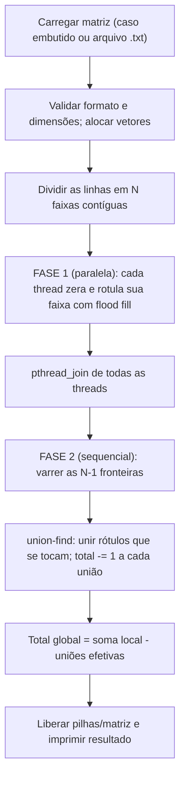
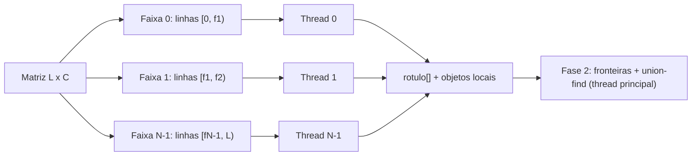
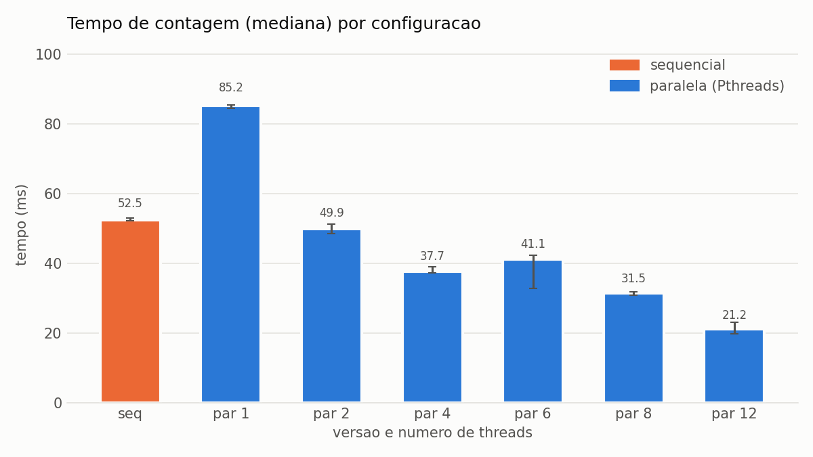
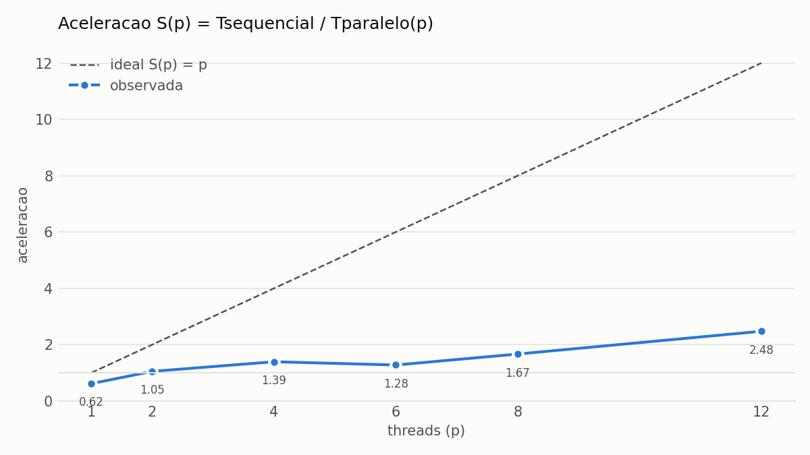
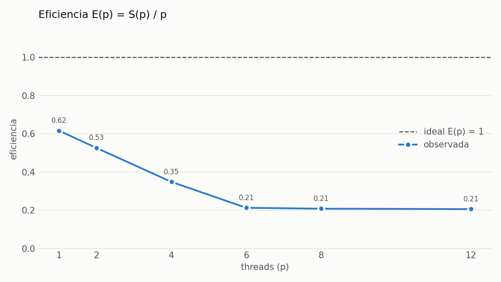

# Relatório técnico - Contagem paralela de objetos em uma matriz binária

> **Disciplina:** Sistemas Operacionais - 2026/II  
> **Professor:** Prof. Filipo Novo Mór  
> **Instituição:** Pontifícia Universidade Católica do Rio Grande do Sul - Escola Politécnica  
> **Repositório:** [URL pública do repositório](https://github.com/LucaWBohnenberger/T1-SisOp) <!-- [PREENCHER] -->  
> **Versão do relatório:** 1.0  
> **Data:** 06/10/2026

## Identificação

| Campo | Informação |
|---|---|
| Integrante 1 | Luca Wolffenbuttel Bohnenberger |
| Matrícula do integrante 1 | [PREENCHER] |
| Integrante 2 | Louise Zanol Northfleet |
| Matrícula do integrante 2 | [PREENCHER] |
| Modalidade | Dupla |
| Turma | [PREENCHER] |
| Estratégia paralela | Pthreads |
| Plataforma testada | Linux (Ubuntu 24.04.5 LTS) |
| Commit avaliado | [`HASH_DO_COMMIT`] <!-- [PREENCHER] após o commit final --> |

## Resumo

O trabalho conta objetos (componentes conexos de células `1` com conectividade 8) em uma matriz binária, com uma versão sequencial e uma paralela em ANSI C (C89). A versão sequencial percorre a matriz e, a cada célula `1` ainda não visitada, conta um objeto e aplica um *flood fill* iterativo com pilha explícita, que marca o componente inteiro. A versão paralela usa Pthreads e divide a matriz em faixas contíguas de linhas, uma por thread. Cada thread rotula os componentes da própria faixa com identificadores globalmente únicos. Depois dos `pthread_join`, a thread principal percorre as linhas de fronteira entre faixas vizinhas e une, com *union-find*, os rótulos de células que se tocam na vertical ou na diagonal, subtraindo 1 da soma das contagens locais a cada união efetiva. As duas versões acertaram as cinco matrizes obrigatórias e sete matrizes adicionais com 1, 2, 3, 4 e 8 threads. O ThreadSanitizer não apontou nenhuma condição de corrida. Numa matriz de 2000×2000 com 8 objetos, a versão paralela atingiu aceleração de 1,39 com 4 threads e 2,48 com 12 threads (mediana de 10 execuções). O ganho foi limitado pelo desbalanceamento de carga entre as faixas, pelo caráter dominado por memória do *flood fill* e pela sobrecarga fixa de alocação e rotulação.

**Palavras-chave:** sistemas operacionais; paralelismo; processos; threads; conectividade 8; flood fill; componentes conexos.

## 1. Visão geral do problema

O programa recebe uma matriz binária na qual `0` representa o fundo e `1` representa o primeiro plano. Um objeto corresponde a um componente de células de valor `1` conectadas horizontalmente, verticalmente ou diagonalmente, conforme a **conectividade 8**.

O projeto contém duas implementações funcionalmente equivalentes:

1. uma versão sequencial, usada como referência de correção e de desempenho;
2. uma versão paralela baseada em Pthreads.

### 1.1 Objetivos da implementação

- Contar corretamente os objetos com conectividade 8.
- Distribuir trabalho efetivo entre pelo menos duas unidades de execução.
- Reconhecer e unificar objetos que atravessam as divisões da matriz.
- Produzir resultados determinísticos e idênticos nas versões sequencial e paralela.
- Evitar condições de corrida, deadlocks, atualizações perdidas e contagens duplicadas.
- Avaliar correção, sobrecarga, escalabilidade, aceleração e eficiência.

### 1.2 Requisitos atendidos

| Requisito | Como foi atendido | Evidência no repositório |
|---|---|---|
| ANSI C C89/C90 | Os dois fontes compilam com `-std=c89 -Wall -Wextra -pedantic` sem nenhum aviso. Só se usam declarações no início dos blocos, comentários `/* */` e nenhum recurso C99. | [`src/`](src/), [`Makefile`](Makefile) |
| Conectividade 8 | Os laços `dl, dc ∈ {-1, 0, 1}` (exceto `(0,0)`) visitam os 8 vizinhos. | `inunda` em [`src/sequencial.c`](src/sequencial.c) (l. 82) e [`src/paralelo.c`](src/paralelo.c) (l. 100) |
| Versão sequencial | *Flood fill* iterativo com vetor `visitado`. | [`src/sequencial.c`](src/sequencial.c) |
| Versão paralela | Faixas de linhas, uma por thread, e consolidação por *union-find*. | [`src/paralelo.c`](src/paralelo.c) |
| Duas ou mais unidades concorrentes | O padrão são 2 threads, e os testes usam 1, 2, 3, 4 e 8. | `make testes`, [`results/testes.log`](results/testes.log) |
| Quantidade configurável de trabalhadores | Último argumento da linha de comando (1 a 64). | `./build/paralelo todos 8`, `./build/paralelo -f arq.txt 8` |
| Consolidação entre regiões | Fase 2 de `conta_objetos`: varredura das fronteiras com `uniao`/`acha`. | [`src/paralelo.c`](src/paralelo.c) (l. 155–242) |
| Tratamento horizontal, vertical e diagonal | Ligações horizontais e dentro da faixa são resolvidas pelo *flood fill*. Na fronteira são verificados os vizinhos abaixo-esquerda, abaixo e abaixo-direita. | Testes `ex3`, `ex5`, `xadrez`, `diagonais_cruzando` |
| Verificação das chamadas POSIX | O retorno de `pthread_create`, `pthread_join`, `clock_gettime`, `malloc` e `fopen` é verificado. | [`src/paralelo.c`](src/paralelo.c) (l. 186–219, 245–255) |
| Liberação dos recursos | Todas as threads criadas recebem `join`, mesmo em caso de erro. Pilhas e matrizes são liberadas com `free`. | `conta_objetos` e `libera_matriz` |
| Compilação reproduzível | `make` / `make testes` / `make bench`. | [`Makefile`](Makefile) |

## 2. Organização do repositório

```text
.
├── README.md
├── RELATORIO_TECNICO.md
├── Makefile
├── src/
│   ├── sequencial.c
│   └── paralelo.c
├── tests/
│   ├── obrigatorios/        ex1.txt ... ex5.txt
│   └── adicionais/          vazia, cheia, xadrez, diagonais_cruzando,
│                            em_u, linha_unica, matriz_grande
├── scripts/
│   ├── gera_matriz_grande.py
│   ├── benchmark.sh
│   └── graficos.py
├── results/
│   ├── medicoes.csv
│   ├── resumo.md
│   ├── testes.log
│   ├── grafico-tempo.png
│   ├── grafico-aceleracao.png
│   └── grafico-eficiencia.png
└── slides/
    └── apresentacao.pdf     [PREENCHER - ainda não criado]
```

| Caminho | Finalidade |
|---|---|
| `src/sequencial.c` | Implementação sequencial de referência. |
| `src/paralelo.c` | Implementação paralela (Pthreads). |
| `tests/obrigatorios/` | As cinco matrizes obrigatórias do enunciado em formato `.txt`. |
| `tests/adicionais/` | Casos de borda e a matriz grande (2000×2000, 8 objetos) usada no desempenho. |
| `scripts/gera_matriz_grande.py` | Gera a matriz grande e confere, com uma BFS independente em Python, que ela tem 8 objetos. |
| `scripts/benchmark.sh` | Executa as medições repetidas e grava `results/medicoes.csv`. |
| `scripts/graficos.py` | Calcula mediana, aceleração e eficiência e gera `results/resumo.md` e os gráficos. |
| `results/medicoes.csv` | Dados brutos das medições de desempenho. |
| `results/testes.log` | Saída completa de `make testes`. |
| `results/*.png` | Gráficos gerados a partir dos dados brutos. |
| `slides/apresentacao.pdf` | Slides utilizados na apresentação. |

## 3. Ambiente de desenvolvimento e execução

### 3.1 Hardware e software

| Item | Especificação |
|---|---|
| Processador | Intel(R) Xeon(R) W-2133 CPU @ 3.60GHz |
| Núcleos físicos | 6 |
| Processadores lógicos | 12 (2 threads por núcleo, Hyper-Threading) |
| Memória RAM | 62 GiB |
| Sistema operacional | Ubuntu 24.04.5 LTS (kernel Linux 7.0.0-34-generic) |
| Arquitetura | x86_64 |
| Compilador | cc (GCC) 13.3.0 (Ubuntu 13.3.0-6ubuntu2~24.04.1) |
| Padrão da linguagem | C89/C90 |
| APIs POSIX utilizadas | `pthread_create`, `pthread_join` (NPTL 2.39), `clock_gettime(CLOCK_MONOTONIC)` |
| Flags de compilação | `-std=c89 -Wall -Wextra -pedantic -O2` (e `-pthread` na versão paralela) |

### 3.2 Compilação

```bash
make clean
make
```

Ou, caso o projeto não use `make`:

```bash
mkdir -p build
cc -std=c89 -Wall -Wextra -pedantic -O2 src/sequencial.c -o build/sequencial
cc -std=c89 -Wall -Wextra -pedantic -O2 -pthread src/paralelo.c -o build/paralelo
```

### 3.3 Execução

```bash
./build/sequencial <caso | todos | lista>
./build/sequencial -f <arquivo.txt>
./build/paralelo <caso | todos | lista> [threads]
./build/paralelo -f <arquivo.txt> [threads]
```

**Exemplo reproduzível:**

```bash
make && ./build/sequencial -f tests/obrigatorios/ex3.txt && ./build/paralelo -f tests/obrigatorios/ex3.txt 4
```

### 3.4 Formato da entrada e da saída

A matriz pode vir de duas fontes:

1. **Casos embutidos:** as cinco matrizes obrigatórias estão no código como vetores `static const int`. São selecionadas por número (`1` a `5`), por `todos` ou listadas com `lista`.
2. **Arquivo texto** (`-f arquivo.txt`): linhas iniciadas por `#` antes do cabeçalho são comentários. O cabeçalho é `linhas colunas [objetos_esperados]`. Seguem `linhas × colunas` valores `0`/`1`, que podem estar separados por espaço, tab, vírgula ou quebra de linha, ou ainda colados (`0110`). Se o terceiro número do cabeçalho existir, o programa compara e imprime `[OK]` ou `[FALHOU]` (código de saída 1 em caso de falha). Erros de formato (caractere inválido, valores a mais ou a menos, cabeçalho inválido) são reportados com mensagem e código de saída 1.

Na versão paralela, o número de threads é o último argumento (padrão 2, máximo 64). Se houver mais threads que linhas, usa-se uma thread por linha.

Exemplo de entrada (`tests/obrigatorios/ex1.txt`):

```text
# Exemplo 1 do enunciado - Identificacao basica
# cabecalho: linhas colunas objetos_esperados
5 5 3
1 1 0 0 0
1 1 0 0 0
0 0 0 1 0
0 0 0 1 0
1 0 0 0 0
```

Saída:

```text
$ ./build/sequencial -f tests/obrigatorios/ex1.txt
tests/obrigatorios/ex1.txt (5x5): obtido=3 esperado=3 [OK] tempo_ms=0.003
$ ./build/paralelo -f tests/obrigatorios/ex1.txt 2
tests/obrigatorios/ex1.txt (5x5) [2 threads]: obtido=3 esperado=3 [OK] tempo_ms=0.237
```

`tempo_ms` mede só a contagem. A leitura do arquivo fica de fora (ver 9.1).

## 4. Arquitetura da solução

### 4.1 Fluxo geral



### 4.2 Estruturas de dados principais

| Estrutura | Tipo/representação | Responsabilidade | Compartilhada? | Proteção utilizada |
|---|---|---|---|---|
| Matriz de entrada | `unsigned char *matriz` (vetor linear `linhas×colunas`, acesso pela macro `CEL`) | Armazenar `0` e `1` | Sim (só leitura) | Nenhuma necessária: ninguém escreve durante a fase 1 |
| Células visitadas/rótulos | Sequencial: `unsigned char *visitado`. Paralela: `int *rotulo` (0 = sem rótulo) | Distinguir células processadas e, na paralela, saber a que componente local cada célula pertence | Sim (vetor único) | Particionamento: cada thread escreve só nas linhas `[ini, fim)` da própria faixa |
| Pilha do flood fill | `int *` com índices lineares, alocada no heap | Percorrer um componente sem recursão | Não: uma pilha por thread (`tarefa.pilha`) | Não se aplica |
| Tarefas/regiões | `struct tarefa { ini, fim, pilha, objetos }`, uma por thread | Distribuir trabalho e devolver a contagem local | Cada `struct` é escrita só pela sua thread | `pthread_join` antes da leitura pela thread principal |
| Equivalências de rótulos | `int *pai` (*union-find*, índices 1..n) | Consolidar componentes | Sim | Fase 1: cada thread inicializa só `pai[id]` dos rótulos que ela cria (posições disjuntas). Fase 2: acesso só pela thread principal |
| Resultados locais | Campo `objetos` de cada `struct tarefa` | Armazenar contagens parciais | Não | `pthread_join` |

## 5. Implementação sequencial

### 5.1 Algoritmo

A função `conta_objetos` zera o vetor `visitado` e percorre a matriz em ordem de linhas. Quando encontra uma célula `1` com `visitado == 0`, incrementa o total e chama `inunda(l, c)`.

`inunda` é um *flood fill* em profundidade com **pilha explícita**:
- Marca a célula inicial e a empilha (como índice linear `l * colunas + c`).
- Enquanto a pilha não estiver vazia, desempilha uma célula e examina os 8 vizinhos: `dl, dc ∈ {-1, 0, 1}`, exceto `(0, 0)`.
- Cada vizinho dentro da matriz, com valor `1` e ainda não visitado, é marcado **no momento em que é empilhado**.

Como a marcação acontece antes de empilhar, cada célula entra na pilha no máximo uma vez. Por isso a pilha tem tamanho máximo `linhas × colunas` e nunca transborda. Ao final, todas as células do componente estão marcadas, e o laço principal não volta a contá-las.

### 5.2 Pseudocódigo

```text
FUNÇÃO contar_objetos_sequencial(matriz):
    visitado[*] ← 0
    total ← 0
    PARA l DE 0 ATÉ linhas-1:
        PARA c DE 0 ATÉ colunas-1:
            SE matriz[l][c] = 1 E NÃO visitado[l][c]:
                total ← total + 1
                inunda(l, c)
    RETORNA total

FUNÇÃO inunda(l0, c0):
    visitado[l0][c0] ← 1 ; empilha (l0, c0)
    ENQUANTO pilha não vazia:
        (l, c) ← desempilha
        PARA cada (dl, dc) em {-1,0,1}² \ {(0,0)}:
            (nl, nc) ← (l+dl, c+dc)
            SE dentro da matriz E matriz[nl][nc] = 1 E NÃO visitado[nl][nc]:
                visitado[nl][nc] ← 1 ; empilha (nl, nc)
```

### 5.3 Complexidade e uso de memória

| Aspecto | Análise | Justificativa |
|---|---|---|
| Complexidade de tempo | Θ(L·C) | Cada célula é lida uma vez pelo laço principal. Cada célula `1` é empilhada e desempilhada uma vez e examina 8 vizinhos (custo constante). |
| Complexidade de espaço | Θ(L·C) | `matriz` e `visitado` usam 1 byte por célula. A pilha usa até 4 bytes por célula. Na matriz 2000×2000, são cerca de 24 MB no pior caso. |
| Risco de recursão excessiva | Não existe | A versão original era recursiva. Na matriz grande, o objeto "serpentina" é um caminho de dezenas de milhares de células, o que poderia estourar a pilha de 8 MB do processo. O *flood fill* passou a usar uma pilha explícita no heap. |

## 6. Implementação paralela

### 6.1 Modelo de concorrência

| Decisão | Escolha do grupo | Justificativa |
|---|---|---|
| Unidade de execução | Thread POSIX | Todas as threads compartilham a matriz e o vetor de rótulos sem cópia nem IPC, e a consolidação lê diretamente o vetor `rotulo`. Com processos seria necessário memória compartilhada ou enviar as linhas de fronteira por *pipe*. |
| Quantidade de trabalhadores | Argumento de linha de comando (1 a 64, padrão 2). Limitado ao número de linhas. | Permite medir várias configurações sem recompilar. |
| Divisão do trabalho | Faixas contíguas de linhas | O acesso fica contíguo na memória (vetor em ordem de linhas). A fronteira entre duas faixas é uma única linha, o que deixa a consolidação simples: só há fronteiras horizontais entre faixas. |
| Escalonamento | Estático (uma faixa por thread, definida antes da criação) | Não exige sincronização durante a fase 1. A contrapartida é o desbalanceamento de carga quando os objetos se concentram em algumas faixas (ver 9.8). |
| Comunicação | Estruturas em memória compartilhada (`rotulo`, `pai`, `struct tarefa`) | Cada thread escreve apenas em regiões disjuntas. |
| Sincronização | `pthread_join` (barreira implícita entre as fases) | A fase 2 só lê dados depois que todas as threads terminaram. Não há região crítica durante a fase 1, então mutexes não são necessários. |

### 6.2 Decomposição da matriz

Com `L` linhas e `N` threads (após `N ← min(N, L)`), calcula-se `base = L / N` e `resto = L % N`. As `resto` primeiras faixas recebem `base + 1` linhas e as demais recebem `base`. Assim, os tamanhos diferem em no máximo uma linha e cobrem `[0, L)` sem sobreposição. Exemplo: 9 linhas e 4 threads geram as faixas `[0,3) [3,5) [5,7) [7,9)`.

Há exatamente uma região por thread. Se o usuário pedir mais threads que linhas (por exemplo, a matriz `linha_unica.txt` de 1×12 com 8 threads), o programa usa uma thread por linha.



### 6.3 Paralelismo efetivo

As threads não são criadas só para executar sequencialmente. Cada uma faz, em paralelo com as outras, todo o trabalho Θ(área da faixa):
- zera os rótulos da sua faixa (`memset`);
- percorre todas as células da faixa;
- executa o *flood fill* de todos os componentes locais.

A thread principal só fica com a fase 2, que custa Θ(C·(N−1)): N−1 linhas de fronteira com 3 comparações por célula. Esse custo é desprezível em relação ao Θ(L·C) da fase 1. As faixas têm o mesmo número de linhas, mas não necessariamente a mesma quantidade de células `1`. O balanceamento é por área, não por trabalho real (ver 9.8).

| Etapa | Sequencial ou paralela? | Unidade responsável | Motivo |
|---|---|---|---|
| Leitura/geração da matriz | Sequencial | Thread principal | Leitura de arquivo é inerentemente serial (`getc`). Fica fora da medição. |
| Particionamento | Sequencial | Thread principal | Cálculo O(N) de `ini`/`fim` e alocação das pilhas. |
| Identificação local | **Paralela** | N threads | Faixas disjuntas e dados independentes. |
| Análise das fronteiras | Sequencial | Thread principal | Custo pequeno (N−1 linhas). Paralelizá-la exigiria proteger o *union-find*. |
| Consolidação | Sequencial | Thread principal | Mesmo motivo. Ocorre durante a varredura das fronteiras. |
| Contagem final | Sequencial | Thread principal | Soma de N inteiros menos o número de uniões. |

### 6.4 Sincronização, comunicação e regiões críticas

| Recurso/dado | Risco concorrente | Mecanismo usado | Escopo da proteção | Justificativa |
|---|---|---|---|---|
| `matriz` | Nenhum (só leitura) | Nenhum | — | Ninguém escreve na matriz durante a contagem. |
| `rotulo` | Condição de corrida se duas threads rotulassem a mesma célula | Particionamento por faixas | Linhas `[ini, fim)` de cada thread | `inunda` rejeita vizinhos com `nl < ini` ou `nl >= fim`. Assim, a thread nunca escreve fora da sua faixa, e a escrita e o `memset` ficam restritos a ela. |
| `pai` (*union-find*) | Atualização perdida se duas threads unissem rótulos ao mesmo tempo | Fase 1: posições disjuntas. Fase 2: uma única thread | Rótulos criados pela thread / toda a fase 2 | Na fase 1, a thread só escreve `pai[id]` para `id = l·C + c + 1` com `l` na sua faixa, e esses índices não se repetem entre faixas. As uniões só acontecem depois dos joins. |
| `tarefa.objetos` | Leitura antes do fim da escrita | `pthread_join` | Toda a fase 1 | O join garante término e visibilidade de memória (*happens-before*) das escritas da thread. |
| Pilhas | Nenhum | Uma pilha por thread | — | Alocadas pela thread principal antes do `pthread_create` e liberadas depois do join. |

**Deadlock:** não há mutexes, semáforos nem espera circular. A única espera é a da thread principal no `pthread_join` de threads que sempre terminam: a fase 1 não bloqueia e não depende de outras threads. Se um `pthread_create` falhar, o programa faz join das threads já criadas, libera as pilhas e retorna `-1`, sem deixar threads órfãs.

## 7. Consolidação dos componentes

Somar as contagens locais não basta: um objeto que atravessa `k` faixas é contado `k` vezes, uma vez em cada faixa. Também pode ser contado mais vezes se, dentro de uma faixa, ele aparecer em pedaços desconexos que só se ligam por outra faixa, como no caso `em_u.txt`.

### 7.1 Identificação local

Cada componente local recebe como rótulo o índice linear da sua **primeira célula** (na ordem de varredura da faixa) mais 1: `id = l × colunas + c + 1`. Como cada célula pertence a exatamente uma faixa, dois componentes distintos (da mesma faixa ou de faixas diferentes) nunca recebem o mesmo rótulo. Não é preciso nenhuma coordenação entre threads para gerar identificadores únicos. O valor `0` fica reservado para "sem rótulo/fundo".

### 7.2 Verificação das fronteiras

Com faixas de linhas, todas as divisões são horizontais. Para cada fronteira entre a faixa `i` (última linha `l = fim_i − 1`) e a faixa `i+1` (linha `l+1`), toda célula rotulada `(l, c)` é comparada com os três vizinhos de baixo.

| Situação | Pares de células verificados | Como a equivalência é registrada |
|---|---|---|
| Fronteira horizontal (objeto cruza de uma faixa para a de baixo pela vertical) | `(l, c)` e `(l+1, c)` | `uniao(rotulo[l][c], rotulo[l+1][c])`. Se os representantes eram diferentes, `total--`. |
| Fronteira vertical (entre colunas) | Não existe nesta decomposição: as ligações na horizontal ficam dentro de uma faixa e são resolvidas pelo *flood fill* local. | — |
| Conexão diagonal através da fronteira | `(l, c)` com `(l+1, c−1)` e `(l+1, c+1)` | Mesmo mecanismo. Testado por `ex3`, `ex5`, `xadrez` e `diagonais_cruzando`. Este último, com 1 linha por thread, tem uniões feitas só por diagonais. |
| Encontro de quatro blocos | Não se aplica (não há cantos onde 4 regiões se encontram). A situação equivalente é um objeto que atravessa 3 ou mais faixas e é unido em cadeia. | O *union-find* une transitivamente. `em_u.txt` e o "X" e o tabuleiro de xadrez da matriz grande atravessam até 12 faixas. |

Pares que já pertencem ao mesmo conjunto (por exemplo, duas células do mesmo componente tocando o mesmo vizinho de baixo) devolvem 0 em `uniao` e não alteram o total. Isso evita subtrair duas vezes.

### 7.3 Unificação e contagem global

Usa-se *union-find* sobre o vetor `pai`. `acha(x)` sobe até a raiz com **compressão de caminho por divisão** (`pai[x] = pai[pai[x]]`). `uniao(a, b)` faz `pai[raiz(b)] = raiz(a)` se as raízes forem diferentes e devolve 1, ou devolve 0 se já forem iguais.

A unificação roda na fase 2, só na thread principal e depois de todos os `pthread_join`, então não precisa de nenhuma outra sincronização.

Cada união efetiva junta dois conjuntos que até então eram contados como objetos distintos. Por isso, o número de representantes distintos é `Σ objetos_locais − (nº de uniões efetivas)`, que é exatamente o valor devolvido.

### 7.4 Exemplo rastreável

Exemplo 2 (6×8, 4 objetos esperados) com **2 threads**: faixa 0 = linhas 0–2, faixa 1 = linhas 3–5. Rótulos ao final da fase 1 (`.` = 0):

```text
linha 0:  .  .  .  .  .  .  7  7      ┐
linha 1:  . 10 10 10 10  .  7  .      │ faixa 0 → 2 objetos locais (7, 10)
linha 2:  .  . 10 10  .  .  .  .      ┘
───────── fronteira ─────────────
linha 3:  .  .  . 28 28  .  .  .      ┐
linha 4:  .  .  .  . 28  .  . 40      │ faixa 1 → 3 objetos locais (28, 40, 41)
linha 5: 41 41  .  .  .  . 40 40      ┘
```

Soma local = 2 + 3 = **5**. A varredura da fronteira (linha 2 contra linha 3) encontra:

| Região | Rótulo local | Células de fronteira relevantes | Equivalência global |
|---|---|---|---|
| Faixa 0 | 10 | (2,2) ↘ (3,3) — diagonal | `uniao(10, 28)` = 1 → total = 4 |
| Faixa 0 | 10 | (2,3) ↓ (3,3) — vertical | `uniao(10, 28)` = 0 (já unidos) |
| Faixa 0 | 10 | (2,3) ↘ (3,4) — diagonal | `uniao(10, 28)` = 0 (já unidos) |
| Faixa 0 | 7 | sem vizinho `1` na linha 3 | permanece {7} |
| Faixa 1 | 40, 41 | não tocam a fronteira | permanecem {40}, {41} |

Resultado: conjuntos {7}, {10, 28}, {40}, {41} → **4 objetos**, igual à versão sequencial. Esse caso mostra por que a contagem por união efetiva é necessária: o objeto central toca a fronteira por três pares de células, mas só pode ser descontado uma vez.

## 8. Correção e testes funcionais

### 8.1 Procedimento de validação

- **Esperado embutido nos testes:** cada caso embutido e cada arquivo `.txt` traz o número esperado de objetos, e os programas imprimem `[OK]`/`[FALHOU]` e retornam código ≠ 0 se errarem.
- **`make testes`:** executa os 5 casos embutidos na versão sequencial e na paralela com 1, 2, 3, 4 e 8 threads. Depois executa todos os arquivos de `tests/obrigatorios/` e `tests/adicionais/` na versão sequencial e na paralela com as mesmas quantidades de threads. Para no primeiro erro. A saída completa está em [`results/testes.log`](results/testes.log).
- **Matriz grande:** o valor esperado (8) foi conferido de forma independente por uma BFS em Python dentro de `scripts/gera_matriz_grande.py`.
- **Ferramentas:**
  - ThreadSanitizer (`-fsanitize=thread`) com 2, 4, 8 e 12 threads na matriz grande e com 8 threads nos arquivos obrigatórios e de fronteira;
  - AddressSanitizer + UndefinedBehaviorSanitizer (com LeakSanitizer) nas duas versões.
- **Erros de entrada:** testados manualmente (ver 10.1).

### 8.2 Matrizes obrigatórias

| Exemplo | Dimensões | Objetos esperados | Resultado sequencial | Resultado paralelo | Trabalhadores | Situação | Evidência |
|---:|---:|---:|---:|---:|---:|---|---|
| 1 | 5 x 5 | 3 | 3 | 3 | 1, 2, 3, 4, 8 | Aprovado | [`results/testes.log`](results/testes.log) |
| 2 | 6 x 8 | 4 | 4 | 4 | 1, 2, 3, 4, 8 | Aprovado | [`results/testes.log`](results/testes.log) |
| 3 | 8 x 8 | 5 | 5 | 5 | 1, 2, 3, 4, 8 | Aprovado | [`results/testes.log`](results/testes.log) |
| 4 | 9 x 12 | 6 | 6 | 6 | 1, 2, 3, 4, 8 | Aprovado | [`results/testes.log`](results/testes.log) |
| 5 | 12 x 12 | 7 | 7 | 7 | 1, 2, 3, 4, 8 | Aprovado | [`results/testes.log`](results/testes.log) |

Os mesmos resultados valem tanto para os casos embutidos quanto para os arquivos `tests/obrigatorios/ex*.txt`.

### 8.3 Casos de teste adicionais

| ID | Dimensões | Característica avaliada | Resultado de referência | Configurações paralelas | Resultado obtido | Situação |
|---|---:|---|---:|---|---:|---|
| A1 `vazia.txt` | 6 x 6 | Matriz vazia ou somente zeros | 0 | 1, 2, 3, 4, 8 | 0 | Aprovado |
| A2 `cheia.txt` | 6 x 6 | Um único objeto ocupando todas as faixas | 1 | 1, 2, 3, 4, 8 | 1 | Aprovado |
| A3 `xadrez.txt` | 6 x 6 | Conexões somente diagonais (seriam 18 com conectividade 4) | 1 | 1, 2, 3, 4, 8 | 1 | Aprovado |
| A4 `matriz_grande.txt` | 2000 x 2000 | Matriz grande usada no desempenho (8 objetos que cruzam várias faixas: retângulo, anel, xadrez, diagonal, serpentina, "X", pente, disco) | 8 | 1, 2, 3, 4, 6, 8, 12 | 8 | Aprovado |
| A5 `diagonais_cruzando.txt` | 8 x 8 | Diagonal e antidiagonal cruzando fronteiras; com 8 threads, toda união é por diagonal | 2 | 1, 2, 3, 4, 8 | 2 | Aprovado |
| A6 `em_u.txt` | 7 x 7 | "U": duas pernas separadas em todas as faixas, unidas só na última linha | 1 | 1, 2, 3, 4, 8 | 1 | Aprovado |
| A7 `linha_unica.txt` | 1 x 12 | Mais threads que linhas e valores sem separador | 4 | 1, 2, 3, 4, 8 (usa 1) | 4 | Aprovado |

### 8.4 Repetibilidade e determinismo

| Teste | Repetições | Configurações | Resultados idênticos? | Observações |
|---|---:|---|---|---|
| Matriz grande (benchmark) | 11 por configuração (1 aquecimento + 10) | Sequencial; paralela com 1, 2, 4, 6, 8, 12 | Sim (8 em todas as 77 execuções) | Coluna `resultado_correto` de [`results/medicoes.csv`](results/medicoes.csv) |
| `make testes` | 1 por configuração | 13 arquivos/casos × 6 configurações | Sim | O resultado não depende da ordem de término das threads: a fase 2 é determinística e os rótulos dependem só da posição das células. |

## 9. Avaliação de desempenho

### 9.1 Metodologia experimental

| Parâmetro | Valor adotado |
|---|---|
| Matriz ou conjunto de matrizes | `tests/adicionais/matriz_grande.txt`: 2000 × 2000 (4·10⁶ células), 912.195 células `1` (densidade 22,8%), 8 objetos. Gerada por `scripts/gera_matriz_grande.py`. |
| Mesmos dados em todas as versões? | Sim, o mesmo arquivo em todas as execuções. |
| Relógio/API de medição | `clock_gettime(CLOCK_MONOTONIC, ...)` |
| Trecho medido | Só a chamada `conta_objetos`. Na sequencial: zerar `visitado`, varredura e *flood fill*. Na paralela: alocação das pilhas, `pthread_create`, fase 1, `pthread_join`, liberação das pilhas e fase 2. Fica **excluída** a leitura do arquivo e a alocação da matriz. |
| Aquecimentos descartados | 1 execução por configuração |
| Repetições por configuração | 10 (cada uma em um processo novo) |
| Medida representativa | Mediana |
| Critério para dispersão | Intervalo interquartil (Q1–Q3), além de mínimo e máximo |
| Carga do sistema durante os testes | Desktop em uso normal (*load average* ≈ 1,7–1,9 antes e depois), sem outras tarefas pesadas. |
| Flags de otimização | `-O2` |

As medições brutas estão disponíveis em [`results/medicoes.csv`](results/medicoes.csv). Para reproduzir: `make bench && make graficos`.

### 9.2 Métricas

A aceleração para `p` trabalhadores é calculada por:

$$
S(p) = \frac{T_{sequencial}}{T_{paralelo}(p)}
$$

A eficiência paralela é calculada por:

$$
E(p) = \frac{S(p)}{p}
$$

### 9.3 Resultados consolidados

| Versão | Trabalhadores (`p`) | Tempo representativo (ms) | Dispersão Q1–Q3 (ms) | Aceleração `S(p)` | Eficiência `E(p)` | Resultado correto? |
|---|---:|---:|---:|---:|---:|---|
| Sequencial | 1 | 52,52 | 52,16–53,07 | 1,00 | 1,00 | Sim |
| Paralela | 1 | 85,23 | 84,51–85,55 | 0,62 | 0,62 | Sim |
| Paralela | 2 | 49,94 | 48,60–51,30 | 1,05 | 0,53 | Sim |
| Paralela | 4 | 37,68 | 37,27–38,97 | 1,39 | 0,35 | Sim |
| Paralela | 6 | 41,11 | 32,84–42,30 | 1,28 | 0,21 | Sim |
| Paralela | 8 | 31,51 | 30,81–31,88 | 1,67 | 0,21 | Sim |
| Paralela | 12 | 21,21 | 19,88–23,08 | 2,48 | 0,21 | Sim |

### 9.4 Dados brutos das repetições

| Versão | Trab. | R1 | R2 | R3 | R4 | R5 | R6 | R7 | R8 | R9 | R10 | Mediana (ms) |
|---|---:|---:|---:|---:|---:|---:|---:|---:|---:|---:|---:|---:|
| Sequencial | 1 | 35,6 | 53,9 | 53,5 | 52,3 | 52,1 | 52,4 | 52,6 | 49,8 | 52,9 | 53,1 | 52,52 |
| Paralela | 1 | 85,3 | 90,2 | 84,4 | 83,5 | 84,1 | 85,4 | 85,6 | 84,8 | 85,2 | 87,7 | 85,23 |
| Paralela | 2 | 51,6 | 48,6 | 49,9 | 47,7 | 48,7 | 48,0 | 56,2 | 50,4 | 57,2 | 50,0 | 49,94 |
| Paralela | 4 | 37,5 | 37,4 | 37,2 | 37,2 | 37,9 | 39,1 | 51,3 | 38,7 | 35,9 | 42,2 | 37,68 |
| Paralela | 6 | 41,8 | 30,0 | 40,7 | 37,9 | 42,5 | 42,8 | 43,4 | 31,2 | 41,5 | 29,8 | 41,11 |
| Paralela | 8 | 35,1 | 31,7 | 34,2 | 31,9 | 31,4 | 30,6 | 30,8 | 30,9 | 31,9 | 28,0 | 31,51 |
| Paralela | 12 | 21,1 | 21,4 | 23,2 | 24,9 | 20,2 | 19,5 | 19,8 | 19,5 | 22,6 | 25,2 | 21,21 |

Todos os tempos estão em ms.

### 9.5 Gráfico de tempo de execução



**Figura 1 -** Tempo de execução da versão sequencial e das configurações paralelas. Barras de erro representam o intervalo interquartil (Q1–Q3) das 10 repetições. Fonte: elaborado pelo grupo.

### 9.6 Gráfico de aceleração



**Figura 2 -** Aceleração observada em função da quantidade de trabalhadores. A linha ideal corresponde a `S(p) = p`. Fonte: elaborado pelo grupo.

### 9.7 Gráfico de eficiência



**Figura 3 -** Eficiência paralela em função da quantidade de trabalhadores. Fonte: elaborado pelo grupo.

### 9.8 Análise dos resultados

- **Ganho em relação à versão sequencial:** a versão paralela passa a ser mais rápida a partir de 2 threads (S = 1,05) e chega a S = 2,48 com 12 threads. A aceleração está bem abaixo da ideal, e a eficiência cai de 0,62 para cerca de 0,21.

- **Por que a versão paralela com 1 thread é mais lenta (S = 0,62):** ela faz o mesmo trabalho que a sequencial, com estruturas mais pesadas e trabalho extra:
  - o vetor `rotulo` usa `int` (4 bytes por célula, 16 MB) em vez do `unsigned char` de `visitado` (4 MB), o que quadruplica o tráfego de memória ao zerar e ao marcar;
  - a cada componente encontrado ela inicializa `pai[id]`;
  - ela aloca a pilha e cria e junta uma thread.

  Num teste complementar fora do benchmark, repetimos a contagem dentro do mesmo processo, já com a memória tocada. A versão sequencial caiu para cerca de 31–41 ms, o que indica que parte relevante do tempo medido é *page fault* no primeiro acesso a memória recém-alocada. Esse custo é maior na paralela, que toca mais memória.

- **Efeito da quantidade de trabalhadores e balanceamento:** a divisão é estática e por número de linhas, mas os objetos não se distribuem uniformemente. Contamos as células `1` por faixa: com 4 threads a faixa mais carregada tem **1,68×** o trabalho médio (384 mil contra 80 mil células na faixa mais leve), e com 12 threads tem **1,97×**. O tempo da fase 1 é o da thread mais lenta, então só esse desbalanceamento já limita a aceleração a cerca de 4/1,68 ≈ 2,4 com 4 threads, antes de qualquer outra sobrecarga.

- **Criação e finalização de threads:** o custo de `pthread_create`/`pthread_join` é da ordem de dezenas de microssegundos por thread, desprezível diante de 20–85 ms. Nas matrizes obrigatórias (5×5 a 12×12), porém, esse custo domina: a contagem sequencial leva cerca de 0,003–0,010 ms, e a paralela leva cerca de 0,2 ms, quase tudo para criar e juntar as threads. Por isso essas matrizes servem para validar a correção, não para medir desempenho.

- **Comunicação, sincronização e contenção:** não há mutexes nem contenção explícita. A única sincronização é o `join`. Existe contenção implícita no **barramento de memória**: o *flood fill* faz pouco cálculo por byte acessado, e as threads competem pela mesma largura de banda de memória e pelo cache L3 compartilhado.

- **Hyper-Threading:** a máquina tem 6 núcleos físicos e 12 lógicos. De 6 para 12 threads, duas threads dividem cada núcleo. Mesmo assim o tempo caiu (41 → 21 ms), porque as faixas ficam menores e o desbalanceamento absoluto diminui. Além disso, as threads passam muito tempo esperando a memória, e o Hyper-Threading aproveita esses intervalos.

- **Anomalia com 6 threads:** a mediana com 6 threads (41,1 ms) foi pior que com 4 (37,7 ms), com dispersão alta (Q1–Q3 de 32,8–42,3 ms, e repetições entre 29,8 e 43,4 ms). Com 6 faixas, um bloco denso (o tabuleiro de xadrez e o anel, linhas 10–600) cai inteiro na primeira faixa (linhas 0–333) e em parte da segunda. Além disso, o escalonador pode colocar duas threads no mesmo núcleo físico enquanto há outros ociosos. Por isso o tempo dessa configuração varia muito de uma execução para outra.

- **Custo da consolidação das fronteiras:** é desprezível. Com 12 threads há 11 fronteiras × 2000 colunas × até 3 comparações, menos de 70 mil operações, contra milhões na fase 1.

- **Trechos que permanecem sequenciais:** além da fase 2, permanece sequencial a alocação das pilhas (`malloc`), pela thread principal, dentro do trecho medido. A leitura do arquivo também é sequencial, mas está fora da medição: leva mais tempo que a própria contagem (cerca de 4 MB lidos com `getc`).

- **Melhorias possíveis** (não implementadas):
  - dividir a matriz em mais faixas que threads e distribuí-las por uma fila dinâmica protegida por mutex, para reduzir o desbalanceamento;
  - usar `rotulo` local por faixa ou um tipo menor, para reduzir o tráfego de memória.

## 10. Tratamento de erros e qualidade do código

### 10.1 Chamadas e recursos POSIX

| Chamada/recurso | Erro verificado? | Ação em caso de falha | Liberação/finalização |
|---|---|---|---|
| `pthread_create` | Sim | Mensagem com `strerror(erro)` e interrupção da criação. Faz join das threads já criadas e `conta_objetos` retorna −1. | `pthread_join` de todas as threads criadas |
| `pthread_join` | Sim | Mensagem e retorno −1. | — |
| `fork` | Não se aplica | — | — |
| mutex/semáforo | Não se aplica (não utilizados, ver 6.4) | — | — |
| `clock_gettime` | Sim | `perror` e `exit(1)` | — |
| `fopen` / formato do arquivo | Sim | `perror` ou mensagem específica (cabeçalho inválido, caractere inválido, valores a mais ou a menos, dimensões fora de 1..20000 ou mais de 10⁸ células). Saída com código 1. | `fclose` em todos os caminhos |
| Memória alocada (`malloc`) | Sim | Mensagem "Memoria insuficiente". Libera o que já tinha sido alocado e retorna erro. | `free` em `libera_matriz` (fim do `main`) e das pilhas ao fim de `conta_objetos` |
| Argumentos | Sim | Número de threads fora de 1..64 ou caso inválido mostram o uso e retornam 1. | — |

### 10.2 Compilação e análise

| Verificação | Comando/ferramenta | Resultado |
|---|---|---|
| Compilação C89/C90 | `make` | Sem erros |
| Avisos do compilador | `-std=c89 -Wall -Wextra -pedantic` | Nenhum aviso nas duas versões |
| Vazamentos de memória | AddressSanitizer + LeakSanitizer (`-fsanitize=address,undefined`), nos casos embutidos e na matriz grande | Nenhum erro, nenhum vazamento e nenhum comportamento indefinido reportado. O Valgrind não estava instalado na máquina de testes. |
| Condições de corrida | ThreadSanitizer (`-fsanitize=thread`, executado com `setarch -R` por causa do ASLR do kernel 7.0) com 2, 4, 8 e 12 threads na matriz grande, e com 8 threads em `ex1`–`ex5`, `em_u` e `diagonais_cruzando` | Nenhum aviso de *data race* |

### 10.3 Separação de responsabilidades

Cada fonte é independente, e as seções são marcadas por comentários:
- **memória** (`aloca_matriz`, `libera_matriz`);
- **processamento** (`inunda`, `conta_objetos`);
- **sincronização e consolidação**, só na paralela (`trabalhador`, `acha`, `uniao` e a fase 2 de `conta_objetos`);
- **medição** (`agora_ms`);
- **entrada** (`carrega` para os casos embutidos, `le_arquivo` para `.txt`);
- **testes e interface** (tabela `casos`, `executa_caso`, `executa_arquivo`, `main`).

A geração de dados, o benchmark e os gráficos ficam fora do código C, em `scripts/`.

## 11. Limitações e decisões de projeto

| Limitação ou decisão | Impacto | Alternativa considerada | Motivo da escolha |
|---|---|---|---|
| Faixas de linhas, e não blocos 2D | Só existem fronteiras horizontais. O "encontro de quatro blocos" do enunciado não ocorre e é demonstrado por objetos que atravessam várias faixas (ver 7.2). | Blocos 2D (como nas grades ilustrativas do enunciado) | Consolidação mais simples e acesso contíguo à memória. O enunciado aceita outras decomposições desde que se demonstrem objetos atravessando regiões. |
| Escalonamento estático (1 faixa por thread) | Desbalanceamento de até 1,97× na matriz grande, o que limita a aceleração. | Fila dinâmica de faixas pequenas com mutex | Sem sincronização na fase 1 e código mais simples de explicar. A melhoria fica registrada como trabalho futuro. |
| Consolidação sequencial | Não escala, mas custa O(C·N), desprezível. | *Union-find* concorrente com mutex ou operações atômicas | Atômicas não fazem parte do C89. Mutex por união seria mais lento que a fase sequencial. |
| Rótulo `int` por célula | 4× mais memória que `visitado` e sobrecarga com 1 thread. | Rótulos locais por faixa (16 bits) com deslocamento | Rótulo global único dispensa tradução na consolidação. |
| Limite de 20000 por dimensão e 10⁸ células | Matrizes maiores são rejeitadas com mensagem. | `size_t` em todos os índices | Mantém os índices lineares em `int` (C89, sem `long long`). |
| *Flood fill* iterativo | Usa até 4 bytes extras por célula para a pilha. | Recursivo (versão inicial) | O recursivo estouraria a pilha de chamadas em objetos grandes (requisito 41). |

## 12. Conclusão

Os objetivos foram alcançados. As versões sequencial e paralela produziram exatamente os mesmos resultados nas cinco matrizes obrigatórias, em sete matrizes adicionais (incluindo casos de borda e uma matriz de 4 milhões de células) e com todas as quantidades de threads testadas. O ThreadSanitizer e o AddressSanitizer não apontaram condições de corrida, vazamentos nem comportamento indefinido. A consolidação por *union-find* trata corretamente objetos que atravessam várias faixas, ligações diagonais na fronteira e objetos cujos pedaços só se unem em outra faixa.

Em desempenho, a versão paralela foi até 2,48× mais rápida que a sequencial (12 threads), mas com eficiência baixa. O principal aprendizado foi que paralelizar corretamente é diferente de paralelizar com ganho. A sincronização ficou mínima: só `pthread_join`, possível porque cada thread escreve em regiões disjuntas. Mesmo assim, o desempenho foi limitado por fatores que não são de sincronização: desbalanceamento de carga numa divisão estática, largura de banda de memória compartilhada e sobrecarga de estruturas maiores na versão paralela.

Como melhoria futura realista, propomos dividir a matriz em muitas faixas pequenas, distribuídas dinamicamente por uma fila protegida por mutex, e reduzir o tamanho do vetor de rótulos. A primeira mudança ataca o desbalanceamento, e a segunda reduz o tráfego de memória.

## 13. Vídeo de apresentação

| Campo | Informação |
|---|---|
| Plataforma | [PREENCHER: YouTube / Vimeo] |
| Link privado ou não listado | [INSERIR URL COMPLETA] |
| Duração | [MM:SS - máximo de 10 minutos] |
| Privacidade | [Não listado / privado compartilhado com o professor / protegido por senha] |
| Senha, se aplicável | [PREENCHER ou `Não se aplica`] |
| Data da última verificação do acesso | [DD/MM/AAAA] |

> **Importante:** o vídeo deve permanecer acessível ao professor durante todo o período de avaliação. No YouTube, um vídeo configurado como privado precisa ser explicitamente compartilhado com a conta indicada pelo professor; se essa conta não estiver disponível, use a opção **não listado**. No Vimeo, informe a senha no quadro acima quando houver proteção por senha. Teste o link em uma janela anônima antes da entrega.

### 13.1 Conteúdo do vídeo

- [ ] Problema e estratégia escolhida.
- [ ] Implementação sequencial e referência de correção.
- [ ] Decomposição, processos/threads e sincronização.
- [ ] Consolidação de objetos que atravessam regiões.
- [ ] Demonstração executável.
- [ ] Testes obrigatórios e adicionais.
- [ ] Resultados de desempenho.
- [ ] Conclusões.
- [ ] Participação de ambos os integrantes.

## 14. Contribuições dos integrantes

| Atividade | Luca Wolffenbuttel Bohnenberger | Louise Zanol Northfleet | Evidência/observação |
|---|---|---|---|
| Projeto da solução sequencial | [PREENCHER] | [PREENCHER] | [PREENCHER] |
| Projeto da solução paralela | [PREENCHER] | [PREENCHER] | [PREENCHER] |
| Sincronização/comunicação | [PREENCHER] | [PREENCHER] | [PREENCHER] |
| Consolidação | [PREENCHER] | [PREENCHER] | [PREENCHER] |
| Testes e medições | [PREENCHER] | [PREENCHER] | [PREENCHER] |
| Documentação e apresentação | [PREENCHER] | [PREENCHER] | [PREENCHER] |

Todos os integrantes declaram compreender integralmente o código, as estruturas de dados, a divisão do trabalho, a sincronização, a comunicação, a consolidação e os resultados apresentados.

## 15. Ferramentas, bibliotecas, referências e códigos externos

| Recurso | Finalidade | Origem/link | Licença, quando aplicável | Partes do projeto afetadas |
|---|---|---|---|---|
| Claude (Anthropic), via Claude Code | Assistente de IA usado para: converter para C o algoritmo originalmente desenvolvido pelo grupo em Python, incluindo as adaptações exigidas pela linguagem; gerar os scripts auxiliares de geração de matrizes, de medição e de gráficos; | https://claude.com/claude-code | Uso conforme os termos da Anthropic | `src/*.c`, `scripts/`, `Makefile`, documentação |
| GCC 13.3 / glibc NPTL 2.39 | Compilação e Pthreads | Ubuntu 24.04 | GPL / LGPL | Todo o código C |
| ThreadSanitizer, AddressSanitizer, UBSan | Verificação de corridas, memória e comportamento indefinido | Integrados ao GCC | — | Seção 10.2 |
| Python 3 + matplotlib | Geração da matriz grande, conferência independente e gráficos | https://matplotlib.org | PSF / BSD-compatível | `scripts/` |
| Editor de tabelas C (Prof. Filipo Mór) | Referência para o formato das matrizes | https://filipomor.com/editor-tabelas-c | — | `tests/` |

A lógica da solução foi concebida pelo grupo. Todo o material produzido com o assistente foi revisado pelo grupo, e a correção foi verificada:
- pelos resultados esperados das matrizes do enunciado;
- pela contagem independente em Python da matriz grande;
- pelas ferramentas de análise da seção 10.2.

## 16. Checklist de entrega

### Código e execução

- [x] O código segue ANSI C C89/C90.
- [x] O projeto compila em Linux ou macOS.
- [x] A compilação ocorre sem erros e os avisos foram tratados ou justificados.
- [x] As principais chamadas POSIX têm os retornos verificados.
- [x] Todos os recursos são finalizados ou liberados corretamente.
- [x] A versão sequencial conta componentes com conectividade 8.
- [x] A versão paralela distribui cálculo real entre pelo menos duas unidades.
- [x] A quantidade de processos/threads é configurável.
- [x] Conexões horizontais, verticais e diagonais são preservadas.
- [x] Componentes que atravessam regiões são consolidados sem duplicidade.
- [x] Não há condições de corrida, deadlocks ou atualizações perdidas conhecidas.

### Testes e desempenho

- [x] As cinco matrizes obrigatórias foram executadas nas duas versões.
- [x] A versão paralela produziu exatamente os mesmos resultados da sequencial.
- [x] Foi criada pelo menos uma matriz maior para o teste de desempenho.
- [x] Foram testadas pelo menos duas quantidades de processos/threads.
- [x] As medições foram repetidas e o valor representativo foi explicado.
- [x] Tempo sequencial, tempo paralelo, aceleração e eficiência foram informados.
- [x] Resultados em que a versão paralela foi mais lenta foram explicados.
- [x] Dados brutos, tabelas e gráficos estão versionados no repositório.

### Repositório e apresentação

- [ ] O repositório do GitHub está público.
- [x] `README.md` contém descrição, autoria, compilação, execução e arquitetura.
- [x] O `Makefile` ou as instruções equivalentes permitem compilação reproduzível.
- [x] As matrizes de teste e seus resultados estão incluídos.
- [x] A análise de desempenho está incluída.
- [ ] Os slides estão em `slides/apresentacao.pdf`.
- [ ] O link do vídeo está acessível e o vídeo tem até 10 minutos.
- [x] Ferramentas, referências, bibliotecas e códigos externos foram identificados.
- [ ] O hash do commit avaliado foi registrado neste relatório.

## Apêndice A - Registro de comandos

```bash
# Informações do ambiente
lscpu | grep -E 'Model name|Core|Thread'
cc --version
uname -sr

# Compilação
make clean && make

# Execução dos testes obrigatórios
make testes                      # saída em results/testes.log
./build/sequencial todos
./build/paralelo todos 4

# Execução dos testes de desempenho
make bench                       # 10 repetições, 1 2 4 6 8 12 threads -> results/medicoes.csv
make graficos                    # results/resumo.md + gráficos

# Verificação de corridas e memória
cc -std=c89 -g -O1 -fsanitize=thread -pthread src/paralelo.c -o par_tsan
setarch $(uname -m) -R ./par_tsan -f tests/adicionais/matriz_grande.txt 8
cc -std=c89 -g -fsanitize=address,undefined -pthread src/paralelo.c -o par_asan
./par_asan -f tests/adicionais/matriz_grande.txt 4
```

## Apêndice B - Formato dos dados brutos

O arquivo `results/medicoes.csv` usa o cabeçalho:

```csv
matriz,linhas,colunas,versao,trabalhadores,repeticao,tempo_ms,objetos,resultado_correto
matriz_grande,2000,2000,sequencial,1,1,35.624,8,true
matriz_grande,2000,2000,paralela,2,1,51.584,8,true
```

## Apêndice C - Correspondência com os critérios de avaliação

| Critério | Peso | Seções com evidências |
|---|---:|---|
| Correção sequencial e paralela, incluindo conectividade 8 | 2,0 | 5, 6, 7 e 8 |
| Decomposição do problema e paralelismo efetivo | 1,5 | 6.1, 6.2 e 6.3 |
| Sincronização, comunicação e ausência de condições de corrida | 1,5 | 6.4 e 10 |
| Consolidação de objetos que atravessam regiões | 1,5 | 7 |
| Testes obrigatórios, adicionais e análise de desempenho | 1,0 | 8 e 9 |
| Qualidade do código ANSI C e tratamento de erros | 1,0 | 3 e 10 |
| Organização do repositório e documentação | 0,5 | 2, 3 e 16 |
| Apresentação, demonstração e domínio da implementação | 1,0 | 13 e 14 |
